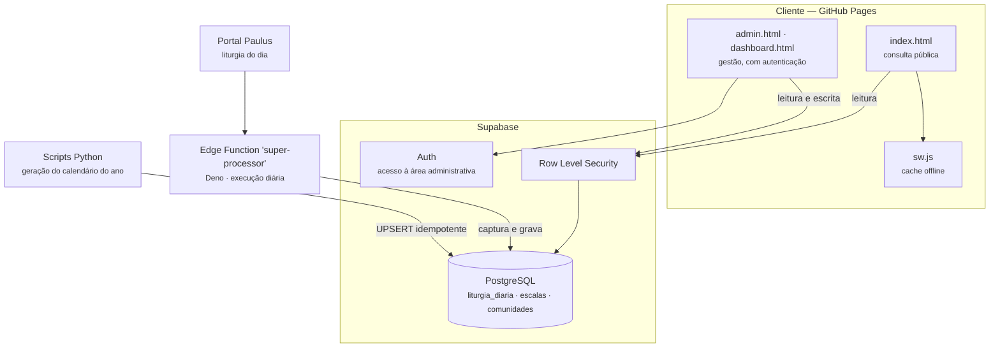

# Calendário Litúrgico Paroquial — Sacristia Digital

Sistema de gestão pastoral em uso diário na **Paróquia Senhor Bom Jesus**, Itabirinha/MG.
Reúne o calendário litúrgico, as escalas das equipes de celebração, o mural de avisos e o
painel administrativo num aplicativo web instalável que funciona offline.

[](https://rodrigodionizio.github.io/calendario-liturgico-paroquial/)
[](./CHANGELOG.md)
[](#pwa-e-funcionamento-offline)
[](#licença)

**Acesso público:** <https://rodrigodionizio.github.io/calendario-liturgico-paroquial/>
**Área administrativa:** `/admin.html` e `/dashboard.html` — exigem autenticação.

---

## O que o sistema resolve

Antes, a escala de cada celebração circulava em papel e grupo de mensagens: quem lê, quem canta,
quem serve o altar. Mudança de última hora não chegava a todo mundo, e não havia registro do que
tinha sido combinado.

O sistema centraliza isso: a coordenação monta a escala no painel, a comunidade consulta no
celular a qualquer hora — inclusive **sem internet**, porque o aplicativo guarda a última versão —
e a liturgia do dia é preenchida automaticamente, sem ninguém precisar digitar.

## Funcionalidades

| Área | O que faz |
| :--- | :--- |
| **Calendário litúrgico** | Celebrações do dia com as cores litúrgicas, tempo do ano e leituras |
| **Escalas de equipes** | Leitura, canto, MEP e coroinhas, por celebração e por comunidade |
| **Mural de avisos** | Comunicados com prioridade (urgente, normal, informativo) e destaque de eventos |
| **Painel administrativo** | Cadastro de eventos, escalas, equipes e comunidades |
| **Relatórios** | Escala impressa em PDF para afixar na secretaria |
| **PWA** | Instalável no celular e utilizável offline |
| **Multi-comunidade** | Uma paróquia com várias comunidades, cada uma com sua escala |

---

## Arquitetura



### Frontend

JavaScript ES6+ sem framework, carregado em ordem explícita — `constants.js` primeiro, porque
`api.js` e as telas dependem dele.

| Arquivo | Responsabilidade |
| :--- | :--- |
| `constants.js` | Constantes de negócio que espelham os enums do banco (tipos de equipe, prioridades do mural) |
| `error-handler.js` | Classe `APIError`, categorização de falhas, retry com backoff exponencial e avisos visuais |
| `api.js` | Camada de acesso ao Supabase, estado central em `AppState` e cache de sessão com TTL |
| `app-new.js` | Tela pública: calendário, modal do dia e mural |
| `calendar-engine.js` | Cálculo e renderização da grade do mês |
| `dashboard.js` | Painel administrativo: eventos, escalas, equipes e comunidades |
| `wordpress-sync.js` | Módulo ES carregado sob demanda; notifica o portal da paróquia após alterações |

### Backend

- **Supabase** — PostgreSQL, autenticação e Row Level Security. As tabelas centrais são
  `liturgia_diaria`, `escalas` e `comunidades` (ver `database/schema.sql`).
- **Edge Function `super-processor`** (`supabase/functions/super-processor/index.ts`) — roda em
  Deno, busca a liturgia diária no Portal Paulus, faz o parsing do HTML e grava em
  `liturgia_diaria`.
- **Scripts Python** (`backend_automacao/`) — `gerador_datas.py` monta o calendário litúrgico base
  de um ano inteiro e insere via UPSERT idempotente, seguro de reexecutar.

### Cache

Duas camadas, para reduzir chamadas ao banco em cerca de 70%:

- **`localStorage`** — eventos por mês (`eventos_AAAA_M`), com TTL de 5 minutos e invalidação
  imediata após qualquer gravação.
- **`sessionStorage`** — dados do modal do dia, durante a navegação.

Ao salvar ou excluir um evento, ambas as camadas são limpas antes de recarregar a grade.

---

## PWA e funcionamento offline

O `sw.js` usa **stale-while-revalidate** para os arquivos estáticos e **network-only** para as
chamadas de API — dados de escala nunca vêm de cache velho.

A lista `ASSETS` do service worker precisa conter exatamente os arquivos que `index.html` carrega.
**A cada deploy que mude essa lista, incremente `CACHE_NAME`**: o evento `activate` apaga
automaticamente os caches de nome diferente, e sem o incremento os visitantes continuam com a
versão anterior.

## Rodar localmente

```bash
git clone https://github.com/rodrigodionizio/calendario-liturgico-paroquial.git
cd calendario-liturgico-paroquial
python3 -m http.server 8000 --directory docs
# abra http://localhost:8000
```

Não abra por `file://` — o service worker, o manifest e os módulos ES exigem HTTP.
Em `localhost` o log detalhado do console fica ativo automaticamente (`IS_DEV` em `api.js`).

### Scripts Python

```bash
cd backend_automacao
python gerador_datas.py                # gera o calendário do ano seguinte
python gerador_datas.py 2027           # gera o ano indicado
python gerador_datas.py 2027 --dry-run # só produz o JSON, não grava no banco
```

---

## Segurança

A chave do Supabase presente em `api.js` é a chave **`anon`**, que é pública por natureza no modelo
do Supabase: ela identifica o projeto, não concede permissão. Quem protege os dados é o
**Row Level Security**, configurado em `database/schema.sql` e `database/FIX_RLS_COMUNIDADES.sql`.

Consequência prática: **toda tabela nova precisa nascer com RLS habilitada e política definida.**
Uma tabela sem política fica legível por qualquer visitante do site. A chave `service_role` nunca
aparece no cliente — ela existe apenas como variável de ambiente da Edge Function.

## Qualidade

O workflow `.github/workflows/qualidade.yml` roda a cada push e verifica sintaxe do JavaScript,
HTML válido, links quebrados e a coerência entre o precache do service worker e os scripts que as
páginas realmente carregam.

## Deploy

GitHub Pages serve a pasta `/docs` da branch `main`. Todo push publica em 1–2 minutos.
Consulte o [CHANGELOG](./CHANGELOG.md) antes de subir uma versão.

---

## Licença

© 2026 Rodrigo Dionizio — **todos os direitos reservados**.

O código está publicamente visível para fins de avaliação técnica e portfólio. **Não** é software
livre: reprodução, distribuição, modificação ou uso em outra paróquia dependem de autorização
expressa do autor.

## Autor

**Rodrigo Dionizio** — Infraestrutura de TI e Desenvolvimento Full Stack
[Portfólio](https://rodrigodionizio.github.io/meuportifolio/) ·
[LinkedIn](https://www.linkedin.com/in/rodrigodionizio) ·
[rodrigo.dionizio@gmail.com](mailto:rodrigo.dionizio@gmail.com)
